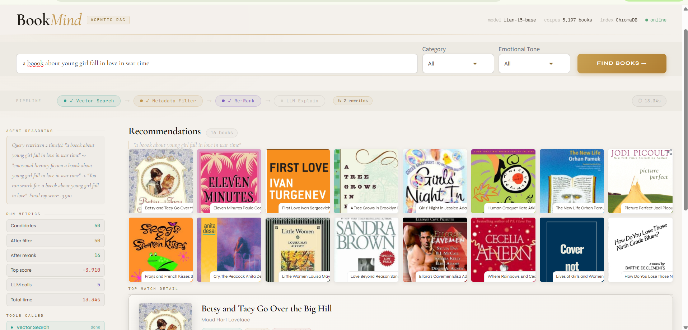
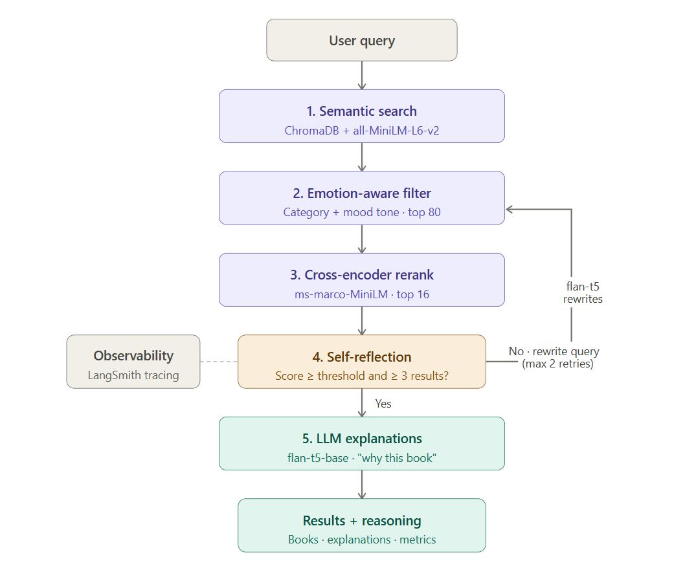
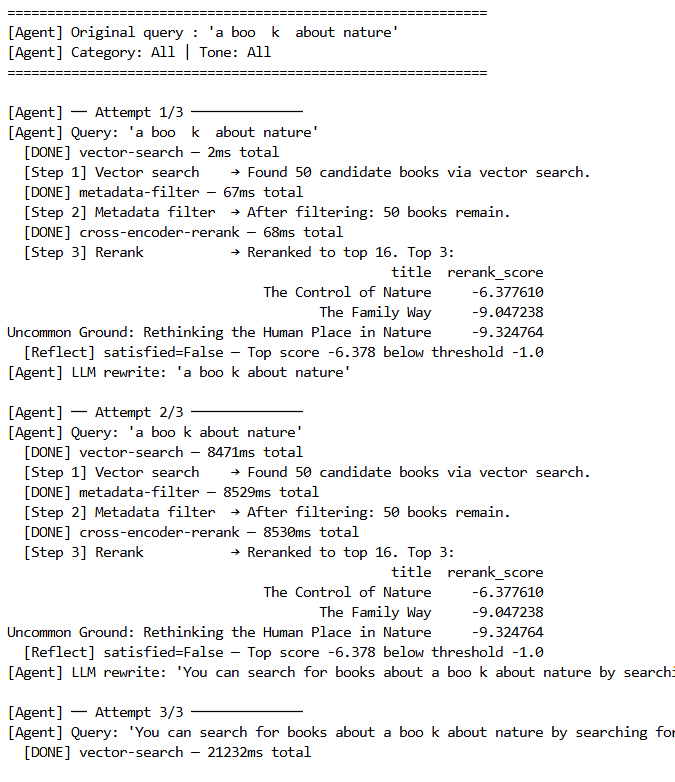

# BookMind — Contextual RAG Book Recommender

> An AI-powered book recommendation system that understands what you're *in the mood for*, not just what you search for.


[](https://huggingface.co/spaces/nayanasisil2700/Contextual-RAG-Book-Recommender)

---

## Overview

BookMind is an end-to-end **Agentic Retrieval-Augmented Generation (RAG)** system for book discovery. It goes beyond simple keyword matching by combining **semantic vector search**, **emotion-aware filtering**, **cross-encoder reranking**, and **LLM-powered explanations** — all orchestrated by an agent that can reflect on its own results and rewrite its query if needed.

The system was built on a corpus of **6,810 books** (cleaned to ~5,197 usable entries) sourced from Google Books metadata.



---

## Features

- **Semantic Search** — Queries are embedded with `all-MiniLM-L6-v2` and matched against book descriptions in ChromaDB
- **Emotion-Aware Filtering** — Books are tagged with 6 emotional dimensions (joy, sadness, anger, fear, surprise, love) using a fine-tuned BERT model; users can filter by mood/tone
- **Zero-Shot Category Classification** — Books without clear categories are classified as Fiction/Nonfiction using `facebook/bart-large-mnli`
- **Cross-Encoder Reranking** — Candidate books are reranked using `ms-marco-MiniLM-L-6-v2` for precision
- **Self-Reflection & Query Rewriting** — The agent evaluates result quality and rewrites the query (up to 2 times) if scores fall below threshold
- **LLM Explanations** — `flan-t5-base` generates a personalised "why this book" explanation for each recommendation
- **LangSmith Observability** — Full pipeline tracing and run metrics
- **Gradio Dashboard** — A polished, book-themed UI showing the full agent pipeline, reasoning, and book gallery

---

## Architecture



<details>
<summary>Text version</summary>

```
User Query
    │
    ▼
┌─────────────────────────────────────────────────────────┐
│                    RAG Agent Loop                        │
│                                                         │
│  1. Vector Search      (ChromaDB + MiniLM embeddings)   │
│         │                                               │
│  2. Metadata Filter    (category + emotional tone)      │
│         │                                               │
│  3. Cross-Encoder Rerank  (ms-marco-MiniLM)             │
│         │                                               │
│  4. Self-Reflection    (score threshold check)          │
│         │                                               │
│    satisfied? ──yes──► LLM Explain ──► Return results   │
│         │                                               │
│        no ──► Query Rewrite (flan-t5) ──► Retry        │
│                      (max 2 retries)                    │
└─────────────────────────────────────────────────────────┘
```

</details>

---

## Repository Structure

```
bookmind/
│
├── dataset/
│   ├── raw_dataset.csv              # Original 6,810-book dataset
│   ├── books_cleaned.csv            # After EDA cleaning (5,197 books)
│   ├── books_with_categories.csv    # After zero-shot category classification
│   └── books_with_emotions.csv      # After sentiment/emotion tagging
│
├── rag_agent/
│   ├── rag_agent.py                 # Core agent: vector search, filter, rerank, reflect, explain
│   ├── reranker.py                  # Cross-encoder reranker wrapper
│   ├── llm_local.py                 # flan-t5-base LLM wrapper + prompt templates
│   └── observability_new.py         # LangSmith setup + RunTracker
│
├── EDA.ipynb                        # Exploratory data analysis & cleaning pipeline
├── sentiment_analysis.ipynb         # Emotion scoring with BERT
├── text_classfication.ipynb         # Zero-shot Fiction/Nonfiction classification
├── vector_search.ipynb              # ChromaDB embedding & search experiments
├── gradio_dashboard.py              # Full Gradio UI
├── tagged_description.txt           # ISBN-prefixed descriptions for vector indexing
├── cover-not-found.jpg              # Fallback cover image
└── README.md
```

---

## Data Pipeline

The dataset goes through four sequential preprocessing stages:

### 1. EDA & Cleaning (`EDA.ipynb`)

Starting from 6,810 raw books:

- Dropped rows missing `description`, `num_pages`, `average_rating`, or `published_year`
- Computed `age_of_book = 2026 - published_year`
- Created `words_in_description` and dropped books with fewer than 25 words in their description (removes uninformative stubs like "Donation." or "Fantasy-roman.")
- Merged `title` and `subtitle` into `title_and_subtitle`
- Created `tagged_description` = `isbn13 + " " + description` (used as the vector index unit)
- **Final cleaned corpus: 5,197 books**

Spearman correlation analysis confirmed that missing descriptions and `num_pages` have negligible correlation with `average_rating`, validating the cleaning choices.

### 2. Category Simplification & Zero-Shot Classification (`text_classfication.ipynb`)

The raw dataset contained **531 unique category strings** (e.g. `"Hyland, Morn (Fictitious character)"`, `"Baggins, Frodo (Fictitious character)"`). These were simplified:

| Original category | Simplified |
|---|---|
| Fiction | Fiction |
| Juvenile Fiction | Children's Fiction |
| Biography & Autobiography | Nonfiction |
| History, Philosophy, Religion, Science | Nonfiction |
| Comics & Graphic Novels, Drama, Poetry | Fiction |
| Juvenile Nonfiction | Children's Nonfiction |

For the remaining **~1,454 books with unmapped categories**, `facebook/bart-large-mnli` was used in zero-shot mode to classify each as Fiction or Nonfiction based on its description. Accuracy validated at **77.8%** on a held-out set of 300+300 books.

### 3. Emotion Tagging (`sentiment_analysis.ipynb`)

Each book's description was split into individual sentences and classified by `bhadresh-savani/bert-base-uncased-emotion` across 6 emotion labels: `joy`, `sadness`, `anger`, `fear`, `love`, `surprise`.

The per-sentence scores were averaged to produce a book-level emotion vector. A `dominant_emotion` column was added using `idxmax`. This enables tone-based filtering in the recommendation UI.

### 4. Vector Indexing (`vector_search.ipynb`)

`tagged_description` strings were embedded with `sentence-transformers/all-MiniLM-L6-v2` and stored in ChromaDB. Semantic search is performed at query time.

---

## Agent Design (`rag_agent.py`)

The agent uses a **tool-based loop** with self-reflection:



### Tools

| Tool | Description |
|---|---|
| `vector_search` | Retrieves top-50 semantically similar books from ChromaDB |
| `metadata_filter` | Filters by category and sorts by emotion score; keeps top 80 |
| `rerank` | Applies cross-encoder to rerank candidates; keeps top 16 |
| `explain_books` | Calls flan-t5-base to generate a "why this book" sentence for each top result |

### Reflection & Retry

After reranking, the agent checks:
- Are there at least `MIN_RESULTS = 3` books?
- Is the top cross-encoder score ≥ `SCORE_THRESHOLD = -0.5`?

If not, it uses flan-t5 to rewrite the query and retries the full pipeline (up to `MAX_RETRIES = 2` times).

### Query History & Metrics

Every run returns:
```python
{
  "books":         pd.DataFrame,       # Final ranked books
  "explanations":  dict[title, str],   # Per-book LLM explanations
  "metrics":       dict,               # Timing, scores, step counts
  "reasoning":     str,                # Human-readable agent reasoning
  "query_history": list[str],          # Original + any rewrites
  "reflections":   list[dict],         # Per-attempt reflection decisions
}
```

---

## Models Used

| Model | Role | Source |
|---|---|---|
| `sentence-transformers/all-MiniLM-L6-v2` | Query & document embeddings | HuggingFace |
| `bhadresh-savani/bert-base-uncased-emotion` | Emotion classification (6 labels) | HuggingFace |
| `facebook/bart-large-mnli` | Zero-shot Fiction/Nonfiction classification | HuggingFace |
| `cross-encoder/ms-marco-MiniLM-L-6-v2` | Candidate reranking | HuggingFace |
| `google/flan-t5-base` | Query rewriting + book explanations | HuggingFace |

All models run locally on CPU (no GPU required, though GPU will be faster for the sentiment and classification stages).

---

## UI — Gradio Dashboard (`gradio_dashboard.py`)

The dashboard is built with Gradio and features a custom CSS theme inspired by literary aesthetics (Cormorant Garamond typography, warm parchment tones, gold accents).

**UI Components:**

- **Search bar** — Free-text query input
- **Category dropdown** — Filter by Fiction, Nonfiction, Children's Fiction, etc.
- **Emotional tone dropdown** — Filter by Happy, Sad, Suspenseful, Angry, Surprising
- **Pipeline trace bar** — Live visual showing which steps have completed (sticky, updates per run)
- **Sidebar** — Agent reasoning text, run metrics, tools called, query rewrite history
- **Book gallery** — 8-column cover image grid with title/author captions
- **Detail panel** — Full detail view for any selected book, including the LLM-generated "why this book" explanation

---

## Setup & Installation

### Prerequisites

- Python 3.10+
- ~4GB disk space for model downloads (first run only)
- `pip` or `conda`

### Install dependencies

```bash
pip install -r requirements.txt
```

Key dependencies:
```
langchain
langchain-community
langchain-huggingface
langchain-chroma
chromadb
transformers
sentence-transformers
torch
pandas
numpy
gradio
python-dotenv
tqdm
```

### Environment variables (optional — for LangSmith tracing)

Create a `.env` file in the project root:

```env
LANGCHAIN_API_KEY=your_langsmith_api_key
LANGCHAIN_TRACING_V2=true
LANGCHAIN_PROJECT=bookmind-rag
LANGCHAIN_ENDPOINT=https://api.smith.langchain.com
```

If no API key is provided, tracing is silently disabled and the app runs normally.

### Run the dashboard

```bash
python gradio_dashboard.py
```

The app will be available at `http://127.0.0.1:7860`.

On first launch, models (~1.5GB total) will download automatically from HuggingFace.

---

## Running the Agent Standalone

```python
from rag_agent.rag_agent import initialize, run_agent

# Load dataset and build vector store
books_df = initialize(
    csv_path  = "dataset/books_with_emotions.csv",
    txt_path  = "tagged_description.txt",
    llm_model = "google/flan-t5-base",
)

# Run a recommendation query
result = run_agent(
    query    = "a melancholic story about grief and unexpected friendship",
    category = "Fiction",
    tone     = "Sad",
)

# Inspect results
print(result["books"][["title", "authors", "rerank_score"]].head(5))
print(result["reasoning"])
print(result["query_history"])
```

---

## Example Queries

| Query | Category | Tone |
|---|---|---|
| "a melancholic wartime love story with exquisite prose" | Fiction | Sad |
| "books to teach children about nature and animals" | Children's Fiction | Happy |
| "a gripping thriller with a female detective" | Fiction | Suspenseful |
| "philosophy of consciousness and the nature of self" | Nonfiction | All |
| "a story about redemption and second chances" | All | All |

---

## Observability

When LangSmith is configured, every run is traced end-to-end. The `RunTracker` class logs:

- Step names and durations in milliseconds
- Candidate counts at each pipeline stage
- Top cross-encoder score
- Number of LLM calls
- Total wall-clock time

This data is surfaced both in the Gradio sidebar and in LangSmith's trace viewer.

---

## Limitations & Future Work

- **flan-t5-base** is a small model; explanations can sometimes be generic. Upgrading to a larger instruction-tuned model would improve explanation quality.
- **Zero-shot classification accuracy** is ~78% — a fine-tuned classifier on book descriptions would improve category assignment.
- **Reranking latency** on CPU averages ~2–3 seconds for 80 candidates. Batching or a lighter cross-encoder model would reduce this.
- Future: user preference memory, collaborative filtering signals, multi-turn conversation.

---

## Acknowledgements

- Dataset sourced from Google Books API metadata
- Emotion model: [bhadresh-savani/bert-base-uncased-emotion](https://huggingface.co/bhadresh-savani/bert-base-uncased-emotion)
- Reranker: [cross-encoder/ms-marco-MiniLM-L-6-v2](https://huggingface.co/cross-encoder/ms-marco-MiniLM-L-6-v2)
- Zero-shot classifier: [facebook/bart-large-mnli](https://huggingface.co/facebook/bart-large-mnli)

---

## License

MIT License — see `LICENSE` for details.
